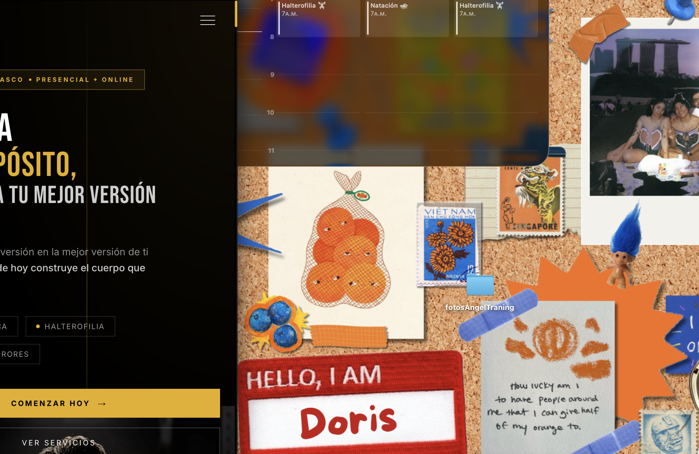
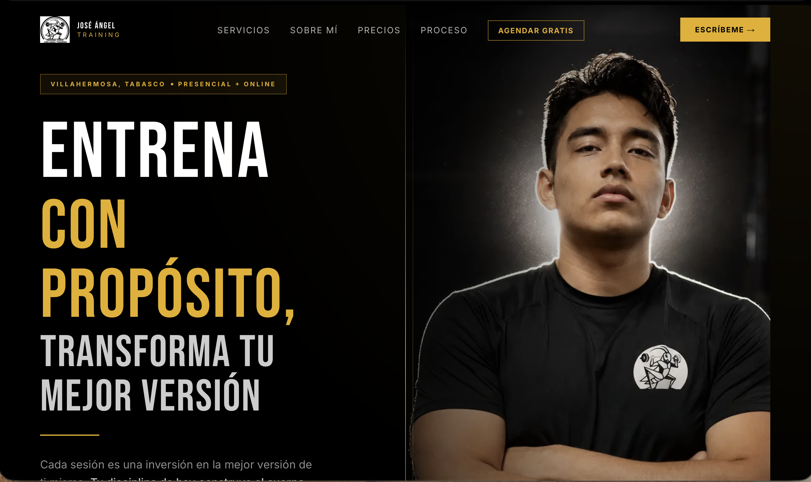
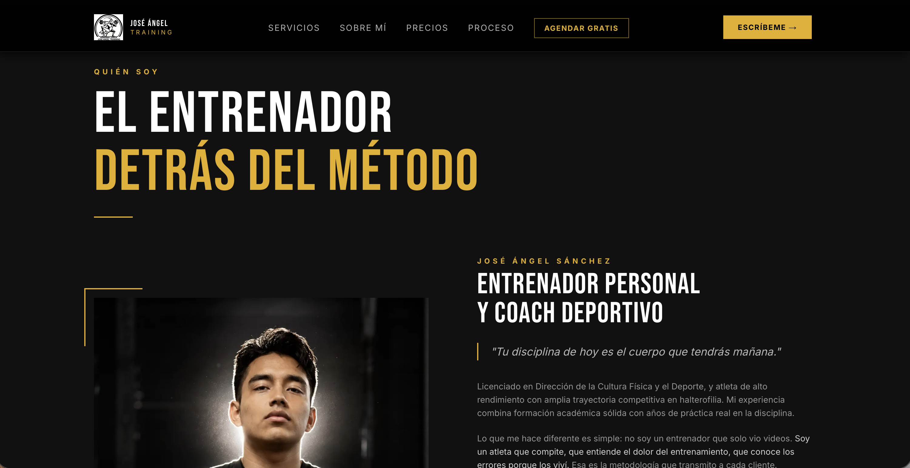
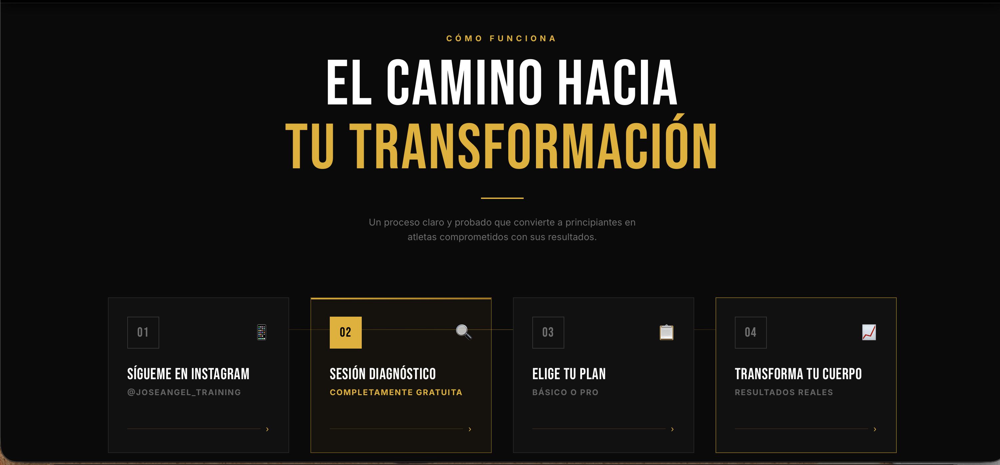
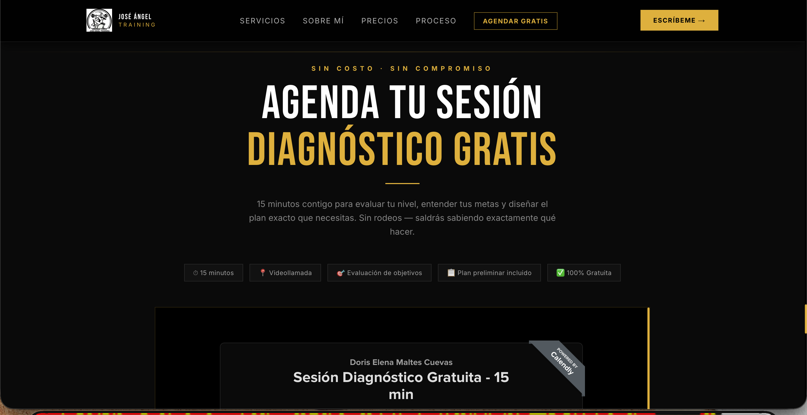
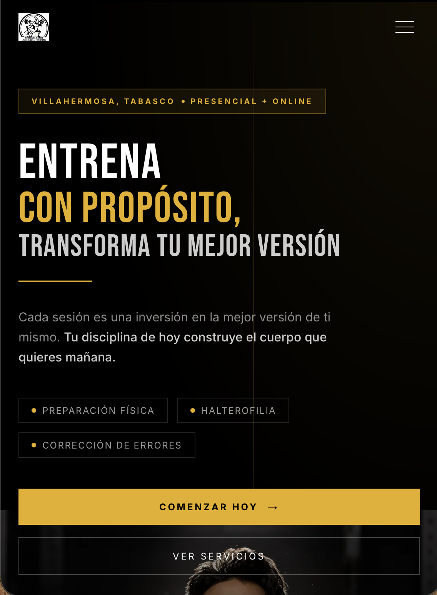
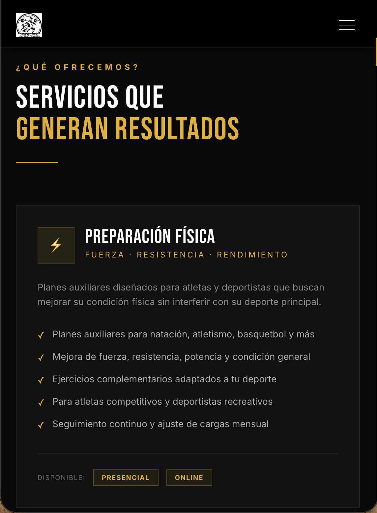
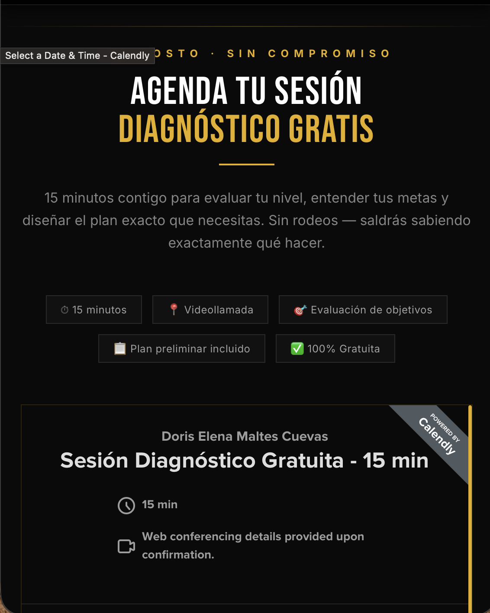

# José Ángel Training — Landing Page

Landing page profesional para la marca personal de **José Ángel Sánchez**, entrenador personal y atleta de alto rendimiento en halterofilia con base en Villahermosa, Tabasco.

> *"Tu disciplina de hoy construye el cuerpo que quieres mañana."*

---

## Vista previa

### Hero


### Servicios


### Sobre Mí


### ¿Por qué entrenar conmigo?


### El proceso


### Precios


### Agenda tu sesión gratuita


### Contacto


---

## Stack técnico

| Tecnología | Versión |
|---|---|
| Next.js | 16 (App Router) |
| TypeScript | 5 |
| Tailwind CSS | 4 |
| next/font | Bebas Neue + Inter |
| Calendly Embed | Widget inline |

---

## Estructura del proyecto

```
jose-angel-training/
├── app/
│   ├── layout.tsx        # Metadata, fuentes, SEO
│   ├── page.tsx          # Composición de secciones
│   ├── globals.css       # Tema de marca, animaciones
│   └── icon.png          # Favicon (logo oficial)
├── components/
│   ├── Navbar.tsx        # Navegación fija con hamburger mobile
│   ├── Hero.tsx          # Sección principal con foto del entrenador
│   ├── Services.tsx      # Preparación Física + Halterofilia
│   ├── About.tsx         # Biografía y credenciales
│   ├── WhyUs.tsx         # Diferenciadores
│   ├── HowItWorks.tsx    # Proceso en 4 pasos
│   ├── Pricing.tsx       # Planes y precios (Presencial / Online)
│   ├── CalendlySection.tsx # Agenda sesión diagnóstico gratis
│   ├── ContactCTA.tsx    # Llamada a acción final
│   └── Footer.tsx        # Pie de página
└── public/
    ├── logo2.png         # Logo oficial de la marca
    └── entrenador.png    # Foto profesional del entrenador
```

---

## Identidad visual

| Elemento | Valor |
|---|---|
| Color primario | `#000000` Negro |
| Color acento | `#E7AE06` Dorado |
| Color secundario | `#AF7503` Ámbar |
| Tipografía display | Bebas Neue |
| Tipografía cuerpo | Inter |

---

## Servicios en la landing

**Preparación Física**
- Presencial: $600 Básico (4 ses.) / $1,000 Pro (8 ses.)
- Online: $350 Básico / $600 Pro

**Halterofilia**
- Presencial: $700 Básico (4 ses.) / $1,200 Pro (8 ses.)
- Online: $450 Básico / $800 Pro

Todos los planes incluyen plan mensual personalizado y comunicación directa con José Ángel.

---

## Correr en local

```bash
npm install
npm run dev
```

Abre [http://localhost:3000](http://localhost:3000) en tu navegador.

## Build de producción

```bash
npm run build
npm start
```

---

## Deploy en Vercel

1. Ir a [vercel.com](https://vercel.com)
2. Importar el repositorio `DorisMaltes/jose-angel-training`
3. Framework: **Next.js** (autodetectado)
4. Click **Deploy**

No se requieren variables de entorno.

---

## Redes

- Instagram: [@joseangel_training](https://www.instagram.com/joseangel_training)
- Calendly: [Agendar sesión gratuita](https://calendly.com/dorise-maltesc/30min)
